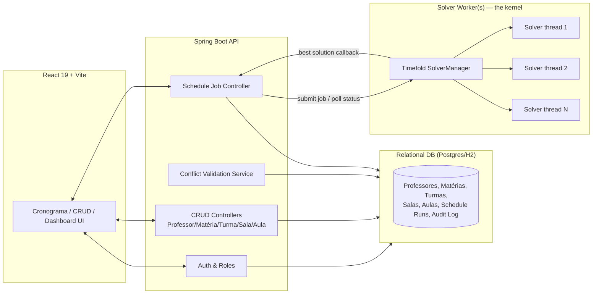

# CHRONAC — Implementation Backlog
### From Timefold prototype to a Spring Boot + React app with a scalable solver worker

**Scope of this document:** turn the current `dev` branch prototype (Java 21 + Timefold Solver + raw JDK HTTP server + React debug UI) into the product described in `RequisitosFuncionais.pdf` (RF01–RF17), using the existing timetabling engine as the **kernel**, wrapped by a Spring Boot API + React frontend, with the solver running as an independently scalable **worker** so multiple solve jobs (and/or multiple candidate solutions) can run at once.

Two working assumptions, since "more than one solution at a given time" is read two ways in the brief — this backlog covers **both**:
- **(a)** Several *different* solve requests (from different coordinators/turmas/semesters) running concurrently, without blocking each other.
- **(b)** A *single* request producing more than one candidate schedule for the coordinator to compare and pick from.

---

## 1. Glossary (domain terms kept in Portuguese, matching the codebase)

| Term | English equivalent | Maps to (code) |
|---|---|---|
| Coordenador | Coordinator (admin role) | new `Role.COORDENADOR` |
| Professor | Teacher | `Subject.teacher` today → becomes its own entity |
| Matéria | Subject | `Subject` |
| Turma | Class / student group | not modeled yet — new entity |
| Sala | Room | `Room` |
| Aula | Lesson (one scheduled class) | `Lesson` |
| Cronograma | Timetable / schedule | `Timetable` |

---

## 2. Current State Summary

**What exists and works:** a Timefold Solver domain model (`Timeslot`, `Room`, `Lesson`, `Subject`, `Week`, `Semester`), 6 constraints (2 hard + 1 buggy-hard + 4 soft — technically "3 hard + 4 soft" once fixed), a raw `com.sun.net.httpserver` endpoint (`GET /api/timetable`), and a React+Vite debug table UI.

**What's missing relative to RF01–RF17:** authentication, roles, persistence, CRUD for Professor/Matéria/Turma/Sala/Aula, conflict validation independent of the optimizer, reallocation flow, dashboard, search, audit log, and any notion of "job" (everything currently runs once, synchronously, for 60 seconds, at process boot).

**Known kernel bugs (must fix before wrapping — bad kernel behavior will just be inherited by the app):**
1. `roomPerSubject` constraint logic is inverted — it penalizes *correct* room assignments.
2. The problem is geometrically tight (1 room × ~100 timeslots vs. 96 lessons) — the demo data barely fits, and any conflict pushes the solve into infeasible territory. Real cadastro data will change this ratio, but the solver needs to handle "no feasible solution" gracefully rather than spin for 60s.
3. `weekOfYear` is derived inside `Lesson.setTimeslot()` and used as a fact in soft constraints — feeding a planning-variable-derived value back into scoring is fragile under Timefold's incremental score calculation.
4. `Semester.holidays` / `validClassDays` can go stale if holidays are set after construction.
5. `Subject.designedRooms` is a public mutable field.
6. Zero tests despite JUnit5 + AssertJ already being a dependency.

---

## 3. Target Architecture

The kernel (Timefold domain + constraints) stays a separate Maven module/package. The API talks to it only through a job interface (submit problem → get jobId → poll/consume result), never by calling `solve()` directly and blocking a request thread. This is what makes "spawn many workers at once" possible later without rewriting the API layer.

---

## 4. Difficulty Scale

| Symbol | Level | Rough effort | Meaning |
|---|---|---|---|
| 🟢 | Easy | hours–1 day | Well understood, low risk, no new architecture |
| 🟡 | Medium | 1–3 days | Some design decisions, touches one layer |
| 🔴 | Hard | 3–5+ days | Cross-layer, real design/research needed |
| ⚫ | Very Hard | 1–2+ weeks | Architectural, high uncertainty, needs a spike first |

Points are rough Fibonacci story points for sprint planning, not hard commitments.

---

## 5. Epics & Issues

### Epic 0 — Kernel Stabilization (do this *first*, everything else builds on it)

| ID | Task | Difficulty | Pts |
|---|---|---|---|
| CHR-1 | Fix inverted `roomPerSubject` constraint (negate the condition) | 🟢 Easy | 1 |
| CHR-2 | Fix `Semester.holidays`/`validClassDays` staleness — recompute on holiday change, or make `Semester` immutable via its builder | 🟢 Easy | 2 |
| CHR-3 | Encapsulate `Subject.designedRooms` (private field, getter, defensive copy) | 🟢 Easy | 1 |
| CHR-4 | Resolve `weekOfYear` derived-in-setter issue — move it off `Lesson` (compute from `Timeslot` directly in constraints) or make it a proper Timefold `@ShadowVariable` | 🔴 Hard | 5 |
| CHR-5 | Add infeasibility handling — detect when hard constraints can't all be satisfied (e.g. via score inspection after termination) and surface a clear "no feasible schedule, here's why" message instead of a silent bad result | 🔴 Hard | 8 |
| CHR-6 | Add unit tests per constraint using Timefold's `ConstraintVerifier` (JUnit5 + AssertJ already on the classpath) | 🟡 Medium | 5 |

### Epic 1 — Domain & Persistence Layer

| ID | Task | Difficulty | Pts |
|---|---|---|---|
| CHR-7 | Add Spring Data JPA + pick DB (Postgres for prod, H2 for tests/local) | 🟡 Medium | 3 |
| CHR-8 | Model persistent entities `Professor`, `Materia`, `Turma`, `Sala`, `Aula`, distinct from the in-memory Timefold planning classes (`Lesson`/`Room`/`Timeslot`); write the mapping layer that turns cadastro data into a planning problem and a solved `Timetable` back into `Aula` rows | 🔴 Hard | 8 |
| CHR-9 | Replace hardcoded `UCs.java` curriculum with data loaded from `Materia`/`Turma` tables | 🟡 Medium | 5 |
| CHR-10 | Flyway (or Liquibase) migrations + seed/demo data | 🟡 Medium | 3 |
| CHR-11 | Bean Validation (`@NotNull`, `@Size`, etc.) on all cadastro DTOs for the "required fields" business rule | 🟢 Easy | 2 |

### Epic 2 — Spring Boot API Migration

| ID | Task | Difficulty | Pts |
|---|---|---|---|
| CHR-12 | Bootstrap Spring Boot (`spring-boot-starter-web`, `-data-jpa`, `-validation`); port `TimetableApp` bootstrap into `@Configuration` beans. Use the **Timefold Spring Boot starter**, which auto-injects a `SolverManager` bean instead of a bare `SolverFactory` | 🟡 Medium | 5 |
| CHR-13a | Professores CRUD (RF02) | 🟢 Easy | 3 |
| CHR-13b | Matérias CRUD (RF03) | 🟢 Easy | 3 |
| CHR-13c | Turmas CRUD (RF04) | 🟢 Easy | 3 |
| CHR-13d | Salas CRUD incl. capacidade (RF05) | 🟢 Easy | 3 |
| CHR-14 | Aulas cadastro endpoint (RF06): professor, matéria, turma, sala, dia, horário início/fim | 🟡 Medium | 5 |
| CHR-15 | Global exception handler + standardized success/error/confirmation response envelope (RF16) | 🟢 Easy | 3 |
| CHR-16 | CORS config for the Vite dev server + static serving for the prod build | 🟢 Easy | 1 |

### Epic 3 — Auth & Authorization

| ID | Task | Difficulty | Pts |
|---|---|---|---|
| CHR-17 | Spring Security: email/password login (RF01), token or session-based auth | 🟡 Medium | 5 |
| CHR-18 | Role model (`COORDENADOR`, `PROFESSOR`) with endpoint-level `@PreAuthorize` rules — "only coordinators cadastro/edit/delete" | 🟡 Medium | 5 |
| CHR-19 | Professor-scoped endpoint enforcing "professor sees only their own cronograma" (RF15) server-side, not just hidden in the UI | 🟡 Medium | 3 |

### Epic 4 — Solver Worker & Multi-Solve Architecture *(the core of this migration)*

| ID | Task | Difficulty | Pts |
|---|---|---|---|
| CHR-20 | Replace the blocking `solverFactory.buildSolver().solve()` call with Timefold's `SolverManager<Timetable, Long>` — jobs are submitted with a problem id and return immediately; a callback delivers the best/final solution | 🟡 Medium | 5 |
| CHR-21 | Configure `SolverManagerConfig.parallelSolverCount` (e.g. a fixed number, or `AUTO` = half the CPU cores) so N submitted problems genuinely solve in parallel threads, not queued one after another | 🟡 Medium | 3 |
| CHR-22 | Job lifecycle endpoints: `POST /api/schedules/solve` → `jobId`; `GET /api/schedules/{jobId}/status`; `GET /api/schedules/{jobId}/result` | 🟡 Medium | 5 |
| CHR-23 | Persist each solve run and its resulting `Timetable` as a versioned "schedule run" row, so concurrent jobs produce comparable, storable candidates | 🔴 Hard | 8 |
| CHR-24 | *(Stretch)* Extract the solver into an independently deployable worker process/container that pulls jobs from a queue (RabbitMQ/Kafka, or simple DB polling) — turns "spawn many workers" into real horizontal scaling across machines, not just threads in one JVM | ⚫ Very Hard | 13 |
| CHR-25 | Multiple-candidates-per-request: run several solver instances for the same input (different random seeds and/or termination configs) and keep the top-K distinct feasible results for the coordinator to compare | 🔴 Hard | 8 |
| CHR-26 | Cancel/kill a running job (`SolverManager` early termination) | 🟢 Easy | 2 |

### Epic 5 — Conflict Validation & Scheduling Flows

| ID | Task | Difficulty | Pts |
|---|---|---|---|
| CHR-27 | Deterministic conflict-check service (independent of the optimizer): same-time professor/sala/turma overlap, run before any Aula insert (RF07's conflict list + the implicit "block insert on conflict" rule right after it in the requirements doc) | 🟡 Medium | 5 |
| CHR-28 | Cronograma generation view assembling all cadastro'd Aulas with conflict badges (RF07) | 🟡 Medium | 3 |
| CHR-29 | Realocação flow (RF09): edit an Aula's horário/sala/professor, re-run the conflict check, optionally re-optimize only the affected slice instead of the whole semester | 🔴 Hard | 5 |
| CHR-30 | Deletion guard (RF13): block/warn on deleting a Professor/Turma/Sala/Matéria still referenced by existing Aulas | 🟡 Medium | 3 |

### Epic 6 — Frontend Rebuild

| ID | Task | Difficulty | Pts |
|---|---|---|---|
| CHR-31 | App shell: routing, layout, per-role auth guard | 🟡 Medium | 5 |
| CHR-32 | Login screen (RF01) | 🟢 Easy | 2 |
| CHR-33 | CRUD screens for Professores/Matérias/Turmas/Salas (forms + tables + delete-guard messaging) | 🟡 Medium | 8 |
| CHR-34 | Aulas cadastro form with live conflict feedback (RF06 + implicit conflict-block rule) | 🟡 Medium | 5 |
| CHR-35 | Cronograma views filterable by professor/turma/sala/dia (RF10) | 🟡 Medium | 5 |
| CHR-36 | Global pesquisa/filtro page across professor, turma, sala, disciplina, período (RF11) | 🟢 Easy | 3 |
| CHR-37 | Dashboard (RF14): counts + conflict alerts, polling job status from Epic 4 | 🟡 Medium | 5 |
| CHR-38 | Candidate-comparison UI for multiple schedules (ties to CHR-25) | 🔴 Hard | 8 |
| CHR-39 | Toast/validation message system (RF16) | 🟢 Easy | 2 |
| CHR-40 | Replace the current debug `App.jsx`: componentize, fix the dark-background/light-text contrast bug, drop unused assets | 🟢 Easy | 3 |

### Epic 7 — Cross-Cutting / Non-Functional

| ID | Task | Difficulty | Pts |
|---|---|---|---|
| CHR-41 | Integration tests for REST endpoints (MockMvc / RestAssured) | 🟡 Medium | 5 |
| CHR-42 | CI pipeline (build + test + lint on PR) | 🟡 Medium | 3 |
| CHR-43 | Dockerize backend + frontend, `docker-compose` for local dev incl. DB | 🟡 Medium | 5 |
| CHR-44 | Histórico de alterações / audit log (RF17 — marked optional/"poderá" in the spec, so lowest priority) | 🟡 Medium | 5 |
| CHR-45 | Update README/git_workflow docs to reflect the new architecture | 🟢 Easy | 2 |

---

## 6. Requirement Coverage Matrix (RF01–RF17)

| RF | Requirement | Covered by |
|---|---|---|
| RF01 | Login email/senha | CHR-17, CHR-32 |
| RF02 | CRUD Professores | CHR-13a, CHR-33 |
| RF03 | CRUD Matérias | CHR-13b, CHR-33 |
| RF04 | CRUD Turmas | CHR-13c, CHR-33 |
| RF05 | CRUD Salas + capacidade | CHR-13d, CHR-33 |
| RF06 | Cadastro de Aulas | CHR-14, CHR-34 |
| RF07 | Geração do cronograma + conflitos (professor/sala/turma) | CHR-20–26 (kernel/jobs), CHR-27, CHR-28 |
| *(unnumbered — "impedir cadastro em conflito")* | Block insert on conflict | CHR-27, CHR-34 |
| RF09 | Realocação de aulas | CHR-29 |
| RF10 | Visualização por professor/turma/sala/dia | CHR-35 |
| RF11 | Pesquisa com filtros | CHR-36 |
| RF12 | Edição de cadastros | CHR-13a–d, CHR-33 |
| RF13 | Exclusão de registros (com guarda) | CHR-30 |
| RF14 | Dashboard inicial | CHR-37 |
| RF15 | Consulta restrita do professor | CHR-19 |
| RF16 | Mensagens de validação | CHR-15, CHR-39 |
| RF17 | Histórico de alterações (opcional) | CHR-44 |

> Note: the source PDF's numbering jumps from the conflict list under RF07 straight to RF09 — there's an unnumbered requirement in between ("Caso exista conflito, o sistema deverá impedir o cadastro e informar o motivo"). Worth flagging back to whoever owns the requirements doc; treated here as part of RF07/CHR-27.

---

## 7. Suggested Delivery Order

1. **Epic 0** — kernel bugs fixed and tested before anything is built on top of it.
2. **Epic 1 + Epic 2 (CRUD subset)** — data layer and Spring Boot skeleton.
3. **Epic 3** — auth, since almost every other endpoint needs roles.
4. **Epic 4** — solver-as-worker migration (this is the architectural centerpiece; do it once the API skeleton exists so there's something to wire it into).
5. **Epic 5** — conflict validation flows, which depend on both persistence (Epic 1) and the worker (Epic 4).
6. **Epic 6** — frontend rebuild, in parallel with Epics 3–5 once endpoints stabilize.
7. **Epic 7** — ongoing throughout, hardened before final delivery.

---

## 8. Key Technical Notes

- **SolverManager, not SolverFactory.solve():** Timefold's `SolverManager` (used by its own Spring Boot starter) is built exactly for this use case — it runs a pool of solvers and lets you submit multiple datasets that solve in parallel, each identified by a problem id, without blocking the calling thread. `SolverManagerConfig.parallelSolverCount` controls how many run concurrently (e.g. set to 4 and a 5th submitted job queues until one finishes). This should be the first step (CHR-20/21) before considering a separate worker process (CHR-24) — it gets "many jobs at once" working inside one Spring Boot app with minimal new infrastructure.
- **True horizontal scaling (CHR-24)** — running solver workers on separate machines/containers — is a bigger step (queue, shared DB for job state, idempotent job pickup) and should only be tackled once CHR-20–23 are stable and there's an actual need for more throughput than one process's thread pool provides.
- **Multiple candidate solutions (CHR-25)** are a different feature from concurrent jobs: it means deliberately running the *same* problem more than once (different seeds/termination) and keeping several distinct feasible results, which needs its own storage and comparison UI (CHR-23, CHR-38).
- **Fixing the kernel before wrapping it (Epic 0)** matters because every bug in the constraint logic or the infeasibility handling will otherwise surface through the new API/UI as confusing or silently wrong schedules, which is much harder to debug once there are more layers on top.

---

## 9. How to Use This Backlog

Each `CHR-#` row is meant to become one issue/ticket. Epics map cleanly to labels (`epic:kernel`, `epic:persistence`, `epic:api`, `epic:auth`, `epic:worker`, `epic:validation`, `epic:frontend`, `epic:ops`). Story points are rough Fibonacci estimates for planning, not fixed commitments — recalibrate after the first sprint.